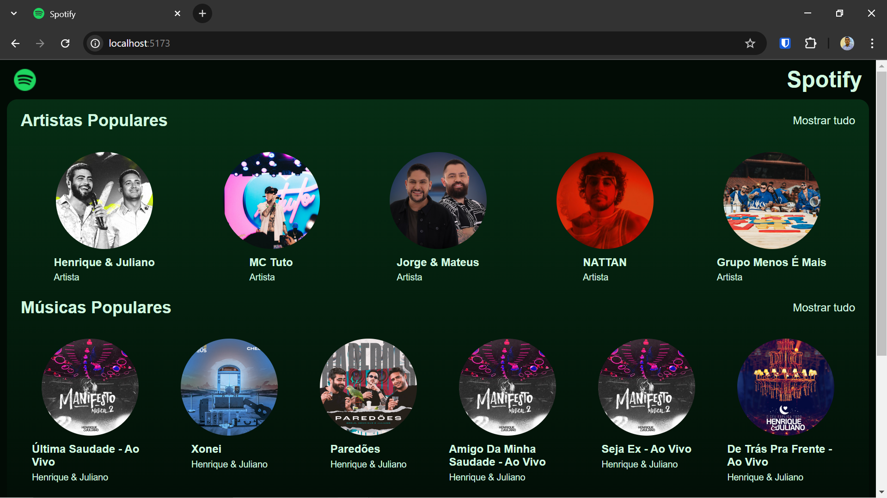
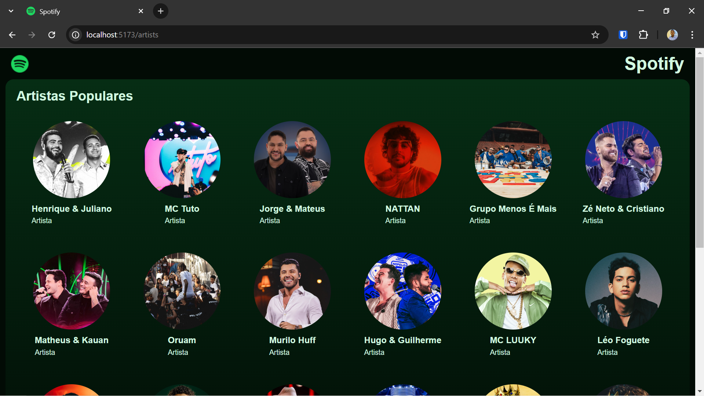
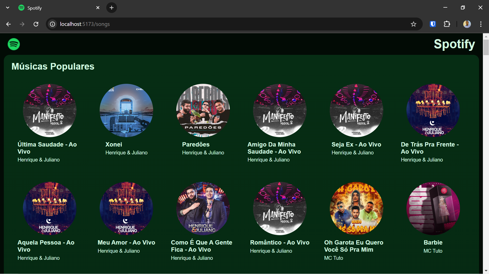
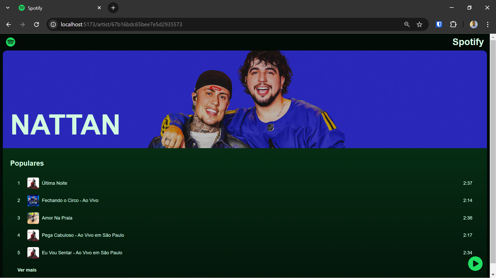
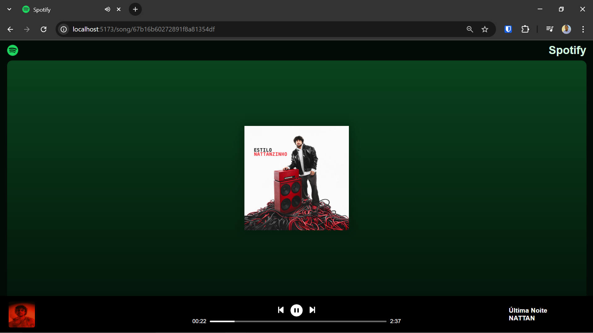

# Desenvolvendo uma réplica do Spotify.
Este é um projeto Full-Stack que tem como objetivo a criação de uma aplicação similar ao Spotify, assim colocando em prática os conhecimentos adquiridos ao longo da caminhada como desenvolvedor.  

##  Homepage
Imagem da aplicação rodando em conjunto com o Back-End:  

##  Funcionalidades

- **Home**: Exibição da lista de 5 artistas populares e 10 músicas populares, junto com o botão para mostrar todos os artistas e todas as músicas.

- **Página de artistas**: Exibição de todos os artistas cadastrados na plataforma.

- **Página de músicas**: Exibição de todas as músicas cadastrados na plataforma.

- **Página do artista**: Exibição de um artista específico, junto com a lista de músicas deste artista.

- **Página do tocador de música**: Exibição dos detalhes da música selecionada e botões play, pause, passar ou voltar música e mostrador do progresso da música em minutos.

##  Endpoints
Utilizado os endpoints:  
*GET http://localhost:3002/artists*  
*GET http://localhost:3002/songs*

## 💻 Tecnologias usadas
* Front-end: HTML, CSS, JavaScript, React, vite.  
* Back-end: JavaScript, Node.js, Express.  
* Ferramentas: Visual Studio Code, GitHub, Trello, Postman, fontawesome.

## ☁️ Banco de dados    
 Para essa aplicação, foi usado o banco de dados [MongoBD](https://www.mongodb.com/pt-br), não sendo necessário a instalação na máquina local, apenas a realização do cadastro no site do MongoDB. Necessário acessar o README localizado na pasta back-end e seguir os passos para criação do banco de dados.

## Documentação Detalhada
Para obter mais informações sobre cada componente do projeto e o passo a passo para execução do mesmo, por favor consulte os READMEs específicos:

- /back-end/README.md
- /front-end/README.md

## 📸 Screenshots
**Homepage**
 

**Página Artistas**

**Página Músicas**

**Página Artista selecionado**

**Página Player Música**
